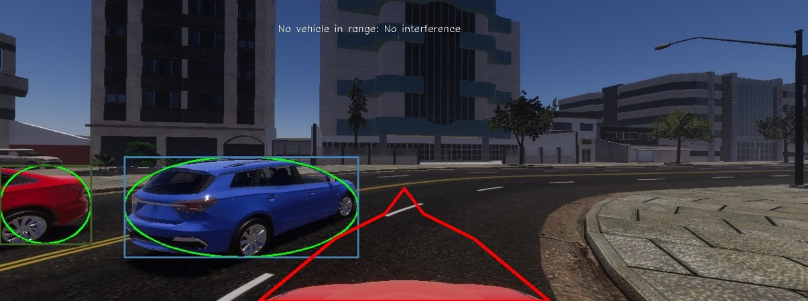

# task3

To run the car in simulator autonomously, open and run the drive_yu.py file. If connection between simulator and code cannot be set, you may check the localhost and your setting host in the bottem of file. Finally, before running the code, check whether your computer has GPU or not. In the code, the device is set as CUDA: 0 as default. 

## Structure of Project

1, Dataset

- Train dataset for Resnet50: collected from recording of simulator, only one front view camera, resolution 1280x460

- Train dataset for yolov5: [Cityscape](https://www.cityscapes-dataset.com/) dataset with three classes aftering preprocessing.

2, Network models

- Resnet50: used to output throttle, brake and steering angles for vehicle controlling.

- yolov5: used to do traffic light detection and vehicle detection.

3, drive.py file

- receive image and vehicle parameter (throttle, brake, steering angle, position, velocity) from simulator

- preprocess the image from the simulator and input it into pretrained resnet50 and yolov5 model.

- use resnet50 to output steering angle and original control command of throttle and brake.

- use yolov5 to output information about detected object boxes. (X_middle-point-of-box, Y_middle-point-of-box, width of box, height of box, confidence, class)

- check the color and distence of detected box of traffic light in front of our car, if it is red light and the distance is smaller than pre-set threthod, output brake=1 and throttle=0.

- Draw an internal tangent ellipse inside the detected vehicle box (car and bus), draw a polygon in front of our vehicle to symbolize the safe area, and do an intersection test on the ellipse and the polygon. If intersects, output brake=1 and throttle=0. (We don't directly use rectangle box for intersection test because there exists extreme cases that causes miss test. For example, if there is a long bus in the track beside our car, the rectangle box can be in front of our car)

- use the output from yolov5 to correct the output from resnet50 and send them as control to simulator

- run drive.py file and do simulator test.

## Resnet50

- Here pretrained Resnet50 is imported and the only change is output channel of fc-layer. We set output channel to three to represent the control command of throttle, brake and steering angle.

- preprocess of trainning dataset:

 a) use letterbox function to resize the input images to 224x224 without changing their original ratio between width and height

 b) use random flip, random shadow, random brightness methods to do data augmentation

 c) use Dataset package to construct dataset for training

- training parameters:

number of epochs: 300

batch size: 32

learning rate: 0.01

optimization: SDG

- result

.png)

## Integrate with your tools

- [ ] [Set up project integrations](https://gitlab.lrz.de/tum-autonomousdriving/praktikum/team07/task3/-/settings/integrations)

## Collaborate with your team

- [ ] [Invite team members and collaborators](https://docs.gitlab.com/ee/user/project/members/)
- [ ] [Create a new merge request](https://docs.gitlab.com/ee/user/project/merge_requests/creating_merge_requests.html)
- [ ] [Automatically close issues from merge requests](https://docs.gitlab.com/ee/user/project/issues/managing_issues.html#closing-issues-automatically)
- [ ] [Enable merge request approvals](https://docs.gitlab.com/ee/user/project/merge_requests/approvals/)
- [ ] [Set auto-merge](https://docs.gitlab.com/ee/user/project/merge_requests/merge_when_pipeline_succeeds.html)

## Test and Deploy

Use the built-in continuous integration in GitLab.

- [ ] [Get started with GitLab CI/CD](https://docs.gitlab.com/ee/ci/quick_start/index.html)
- [ ] [Analyze your code for known vulnerabilities with Static Application Security Testing(SAST)](https://docs.gitlab.com/ee/user/application_security/sast/)
- [ ] [Deploy to Kubernetes, Amazon EC2, or Amazon ECS using Auto Deploy](https://docs.gitlab.com/ee/topics/autodevops/requirements.html)
- [ ] [Use pull-based deployments for improved Kubernetes management](https://docs.gitlab.com/ee/user/clusters/agent/)
- [ ] [Set up protected environments](https://docs.gitlab.com/ee/ci/environments/protected_environments.html)

***

# Editing this README

When you're ready to make this README your own, just edit this file and use the handy template below (or feel free to structure it however you want - this is just a starting point!). Thank you to [makeareadme.com](https://www.makeareadme.com/) for this template.

## Suggestions for a good README
Every project is different, so consider which of these sections apply to yours. The sections used in the template are suggestions for most open source projects. Also keep in mind that while a README can be too long and detailed, too long is better than too short. If you think your README is too long, consider utilizing another form of documentation rather than cutting out information.

## Name
Choose a self-explaining name for your project.

## Description
Let people know what your project can do specifically. Provide context and add a link to any reference visitors might be unfamiliar with. A list of Features or a Background subsection can also be added here. If there are alternatives to your project, this is a good place to list differentiating factors.

## Badges
On some READMEs, you may see small images that convey metadata, such as whether or not all the tests are passing for the project. You can use Shields to add some to your README. Many services also have instructions for adding a badge.

## Visuals
Depending on what you are making, it can be a good idea to include screenshots or even a video (you'll frequently see GIFs rather than actual videos). Tools like ttygif can help, but check out Asciinema for a more sophisticated method.

## Installation
Within a particular ecosystem, there may be a common way of installing things, such as using Yarn, NuGet, or Homebrew. However, consider the possibility that whoever is reading your README is a novice and would like more guidance. Listing specific steps helps remove ambiguity and gets people to using your project as quickly as possible. If it only runs in a specific context like a particular programming language version or operating system or has dependencies that have to be installed manually, also add a Requirements subsection.

## Usage
Use examples liberally, and show the expected output if you can. It's helpful to have inline the smallest example of usage that you can demonstrate, while providing links to more sophisticated examples if they are too long to reasonably include in the README.

## Support
Tell people where they can go to for help. It can be any combination of an issue tracker, a chat room, an email address, etc.

## Roadmap
If you have ideas for releases in the future, it is a good idea to list them in the README.

## Contributing
State if you are open to contributions and what your requirements are for accepting them.

For people who want to make changes to your project, it's helpful to have some documentation on how to get started. Perhaps there is a script that they should run or some environment variables that they need to set. Make these steps explicit. These instructions could also be useful to your future self.

You can also document commands to lint the code or run tests. These steps help to ensure high code quality and reduce the likelihood that the changes inadvertently break something. Having instructions for running tests is especially helpful if it requires external setup, such as starting a Selenium server for testing in a browser.

## Authors and acknowledgment
Show your appreciation to those who have contributed to the project.

## License
For open source projects, say how it is licensed.

## Project status
If you have run out of energy or time for your project, put a note at the top of the README saying that development has slowed down or stopped completely. Someone may choose to fork your project or volunteer to step in as a maintainer or owner, allowing your project to keep going. You can also make an explicit request for maintainers.
